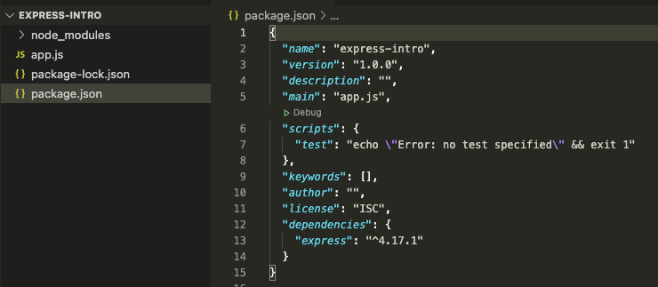
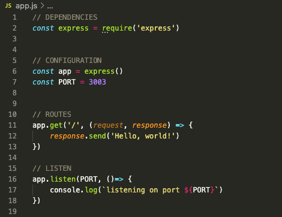
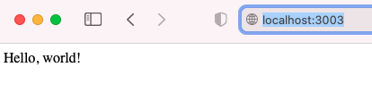
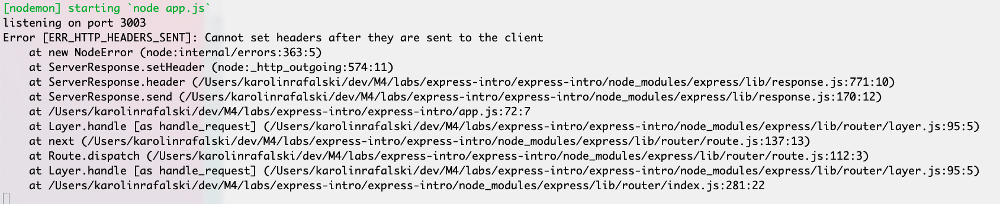
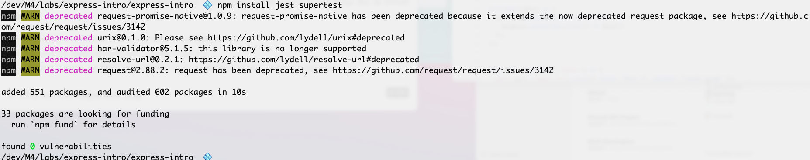
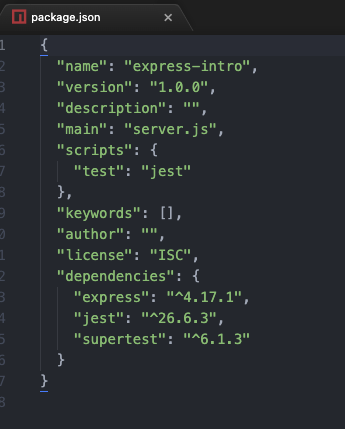
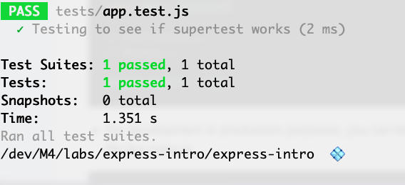
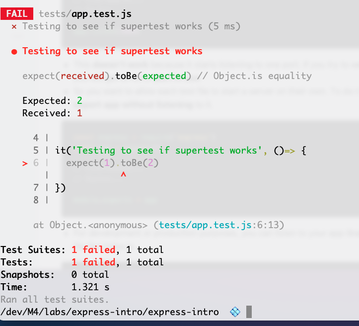

# Introduction to Express

## Getting Started

There are no tests for this assignment. The bonus is to write your own tests. Your instructors will still review your work on Github.

- Fork this repo
- `git clone` the forked repository
- `cd` to the directory where you cloned it
- `touch app.js`
- `npm init`
  - follow the prompts and confirm settings (this is just practice so it's ok to not provide much information/make a mistake/keep it simple)
- `npm install express`


<details><summary>Success!</summary>



</details>


<br />

- Write a basic express server.

<details><summary>Hint</summary>



</details>

<br />


- Start your server with `nodemon`
- go to http://localhost:3003 to see your message


<details><summary>Success!</summary>



</details>

<br />

**Troubleshooting**

- `nodemon `can't find file/module
  - confirm you are on the same level as `package.json` when running `nodemon`
  - check the `package.json` that the key for `"main"` matches your file name, with the way we set it up, it should be `"main" : "app.js"`
    - you can edit `package.json` to have the correct file name. Be sure to follow proper JSON (double quotes, closing all the brackets, checking that all the commas are in the correct place)
    - or you can change the name of your file to match what is in your `package.json`
Note for this intro lab, it is unimportant which solution you choose, as long as you get it to work.


## Activity Catchphrases Express

Use the route `/terminator` and the catch phrase `I'll be back`

Choose 9 more catchphrases from below, or find your own. For each catchphrase:

Create a route based on the person's name, then respond with their catchphrase.

For example:
- Tim Gunn - Make it work

```js
 app.get('tim-gunn', (req, res) => {
   res.send('Make it work')
 })
```

Test by going to http://localhost:3003/tim-gunn

**Thought questions**
- What characters are allowed in a URL?
- What happens if you try to create a URL `/tim gunn`
- Is there a difference between `/timgunn` and `/TimGunn` and `/tim/gunn`?
- If you have a phrase like `Here's looking at you, kid`, how do you deal with the `'` in `Here's`?

<hr />

**Choose Some Catchphrases to build routes**

- Emeril - Bam!
- Steve McGarrett - Book 'em Danno!  
- Coach Taylor - Clear eyes, full hearts, can't Lose
- Homer Simpson - D'Oh
- Bruce Banner - Don't make me angry
- JJ Evans - Dy-no-myte!
- Batman - To the Batmobile!
- Hannibal Smith - I love it when a plan comes together
- Fraiser - I'm listening
- Regis - Is that your final answer?
- Borg - Resistance is futile
- Fox Mulder - The truth is out there

- Harry Callahan - Go ahead, make my day
- Travis Bickle - You talkin' to me?
- Tony Montana - Say hello to my little friend
- Zeus - Release the Kraken
- James Bond - the name is Bond, James Bond
- Dorothy - Toto, I've got a feeling we're not in Kansas anymore
- Rod Tidwell - Show me the money!
- Frankenstein - It's alive! It's alive
- Jim Lovell - Houston, we have a problem
- Rocky - Yo, Adrian
- Gollum - My precious
- Jack Dawson - I'm king of the world!


### Terminator again

The Terminator has another famous catchphrase:

`Hasta la vista, baby`

Try to add it to your previous ROUTES

```js
app.get('terminator', (req, res) => {
  res.send('I\ll be back')
  res.send('Hasta la vista, baby')
})
```

What do you see in your browser?
 - Both messages?
 - One message (which one)
 - An error?

Check terminal:


<details><summary>Possible Error Message</summary>



</details>

What does this error message mean?

<details><summary>Hint/Reminder</summary>

The `http` protocol is very specific in that there is one `response` for every `request`.

In this case we are breaking the protocol and trying to send two responses for one request.

The error message is telling us that we are trying to set another set of headers after the first one.

Since the error happens after the first response is sent, we should still see our first response in the browser.

We can look through the `call stack` of the error messages. This is the order of the code that lead to the error. Many of these files are in `node_modules` - therefore it is not code we have written. But we can find that in the screenshot of _my_ error above, I have an error on `app.js 72:7` - this means that I can look to that file that I wrote and find that line of code that I have written to see what I wrote that may have (likely has) triggered the error, and indeed, that is where I have sent two responses.

I can resolve this, by combining the res.send, into one string. Or I could possibly create a new route `/terminator2` or an even different solution- it would depend on what my goal is for the user/application.


</details>

## Activity Magic 8 Ball

Create a new route `/magic8`

That randomly returns one of the following responses, each time you visit the site.

Add this code to your `app.js` (Where? Anywhere? Inside your route? Feel free to experiment in order to learn more about how JavaScript/Express works)

```js

const magic8Responses = [
  "It is certain",
  "It is decidedly so",
  "Without a doubt",
  "Yes - Definitely",
  "You may rely on it",
  "As I see it, yes",
  "Most likely",
  "Outlook good",
  "Yes, and signs point to yes",
  "Reply hazy, try again",
  "Ask again later",
  "Better not tell you now",
  "Cannot predict now",
  "Concentrate and ask again",
  "Don't count on it",
  "My reply is no",
  "My sources say no",
  "Outlook not so good",
  "Very doubtful"

]
```

<details><summary>Hint</summary>

[Math.random documentation](https://developer.mozilla.org/en-US/docs/Web/JavaScript/Reference/Global_Objects/Math/random)

</details>

**Stretch**

Make your response appear as an `<h1>` tag.

<details><summary>Hint/Example</summary>

```js
  res.send(`<h1>${magic8Answer}</h1>`)
```

</details>


## Bonus

### Create Your Own Tests

- cancel <kbd>control</kbd> <kbd>c</kbd> out of `nodemon`, for now

#### Install NPM Packages

We can write our own tests to test our API.

First, we'll need to add two more `npm` packages

- make sure you are on the same level as your `package.json` in terminal
- `npm install jest supertest` - this will install two packages, `jest` and `supertest`

<details><summary>Success</summary>

You may see a few warnings in terminal like so:



<hr />

A note on warnings:


What can you do? For now, because it is lab/class time, it is not worth trying to solve. If you were working on a job, you would want to see if there is a way to fix the depreciations - sometimes there is not a way to fix it yet, you just have to wait until the devs in charge of those packages create a fix. Usually, just make a mental note this is something you may need to come back to in the future.

<hr />

Successful, installation - check your `package.json`





</details>


#### Set up Files and Folders

- Make sure you are on the same level as your `package.json` in terminal
- `mkdir tests`
- `touch tests/app.test.js` - This makes sense to name this according to the file you are testing. In our case it is `app.js` - you could name it `batman.test.js`, but your colleagues would not be happy with you. It must have `.test.js` as the extension in order to run correctly.

We will need to `require` both `supertest` and our `app.js` files.

When it is an `npm` package - then we `require` just the name of the `npm`
 package:  `const supertest = require('supertest')`

When it is a file we created, we must add the relative path to the file, based on the current file. In this case, `app.js` is one director up from `tests` : `const app = require('../app.js')`
**tests/app.test.js**

#### Set up `package.json`

We need to specify how to run the test. In `pakcage.json`, change the value of `test` inside the script object to be:


```js
"scripts": {
  "test": "jest"
},
```
#### Basic Test

Let's write a very simple test to make sure everything works as expected

`it` is a function that takes a string as the first parameter, and a callback function as the second parameter.

```js
 it()
```

```js
 it('Testing to see if supertest works')
```

```js
 it('Testing to see if supertest works', ()=> {})
```

Inside our callback, we'll use two functions changed together:


`expect` and `toBe`

```js
const supertest = require('supertest')

 it('Testing to see if supertest works', ()=> {
   expect(1).toBe(1)
 })
```

**Terminal**

`npm test`

<details><summary>Test Passes</summary>



</details>

Let's make the test fail, to see the difference:

```js
const request = require('supertest')

 it('Testing to see if supertest works', ()=> {
   expect(1).toBe(2)
 })
```

<details><summary>Test Fails</summary>



</details>


#### Test Your App/Route

We have to do a bit more set up in order to get our server working.


##### Export app

- First we must `export` our `app`. By default, nothing is exported from a file we write in our node projects. We have to specify what we want to export. In this case we want `app` from the `app.js` file exported.

- The syntax `module.exports` is very important and must be spelled exactly, or else it wont work.


**app.js**

```js
// DEPENDENCIES
const express = require('express')


// CONFIGURATION
const app = express()
const PORT = 3003


// ROUTES
app.get('/', (request, response) => {
    response.send('Hello, world!')
})

// LISTEN
app.listen(PORT, ()=> {
    console.log(`listening on port ${PORT}`)
})

// EXPORT
module.exports = app

```

##### Split Your App from Your server

- make sure you are on the same level as your `package.json` in terminal
- `touch server.js`

- `require` your app in your `server.js` and also, move your
- `app.listen` and `PORT` to this file

**server.js**

```js
// DEPENDENCIES
const app = require('./app.js')

// CONFIGURATION
const PORT = 3003

// LISTEN
app.listen(PORT, ()=> {
    console.log(`listening on port ${PORT}`)
})

```

##### Update Your `package.json`

```js
  "main": "server.js",
```

##### Test that your app still works

run `nodemon` - and test that nodemon does not crash and any route is available to you in your browser


##### Import app

**tests/app.test/js**

```js
const app = require('../app.js')
```


#### Write A Test for Your Route

We are going to write a more descriptive test now. Jest has many functions that help us test and describe our apps, making our tests very readable.

We'll start with the function `describe`. It takes a string as the first argument and a callback as a second argument.

```js

describe('Test the root path', () => {

})

```

Inside of `describe`, we will add another function called `test`. It takes a string as the first argument and a callback as a second argument.

```js

describe('Test the root path', () => {
  test('It should response the GET method', () => {

  })
})

```

Next we want to `return` the `request` function and pass in `app`

```js

describe('Test the root path', () => {
  test('It should response the GET method', () => {
    return request(app)
  })
})

```

Now, we want to test the `/` route, which should be returning `Hello, world!`

We want to wait for the response. so after calling `.get('/')`, we'll call on the function `.then()` (which takes a callback) and there we will use `expect` and `toBe` functions to assert our test.

```js
describe("Test the root path", () => {
  test("It should response the GET method", () => {
    return request(app)
      .get("/")
      .then(response => {
        expect(response.text).toBe('Hello, world!');
      })
  })
})

```

This isn't the best test. As we increase our complexity of our apps, getting the exact text will not be the most sensible choice. Rather we would often just like to get the status


```js
describe("Test the root path", () => {
  test("It should response the GET method", () => {
    return request(app)
      .get("/")
      .then(response => {
        expect(response.statusCode).toBe(200)
      })
  })
})
```

**Full code: test/app.test.js**

```js
// DEPENDENCIES
const app = require('../app.js')
const request = require('supertest')

// it('Testing to see if supertest works', ()=> {
//   expect(1).toBe(1)
// })


describe("Test the root path", () => {
  test("It should response the GET method", () => {
    return request(app)
      .get("/")
      .then(response => {
        expect(response.statusCode).toBe(200)
      })
  })
})
```

#### Last details
We can add the status code we want. By default a successful response will have a status code of 200.


**app.js**

```js
// ROUTES
app.get('/', (request, response) => {
    response.status(200).send('Hello, world!')
})

```

We can test another status code, like [418](https://developer.mozilla.org/en-US/docs/Web/HTTP/Status/418)

Although, we would want our status codes to be accurate/descriptive. As a proof of concept/working code, let's try 418:


**app.js**

```js
// ROUTES
app.get('/', (request, response) => {
    response.status(418).send('Hello, world!')
})

```

**test/app.js**

```js
describe("Test the root path", () => {
  test("It should response the GET method", () => {
    return request(app)
      .get("/")
      .then(response => {
        expect(response.statusCode).toBe(418)
      })
  })
})
```


[Jest Documentation](https://jestjs.io/docs/testing-frameworks)
[Reference from Jest Documentation](https://www.albertgao.xyz/2017/05/24/how-to-test-expressjs-with-jest-and-supertest/)

##### Bonus - HTTP Status Code Visualizations

[HTTP Cats](https://http.cat)

[HTPP Dogs](https://httpstatusdogs.com)
